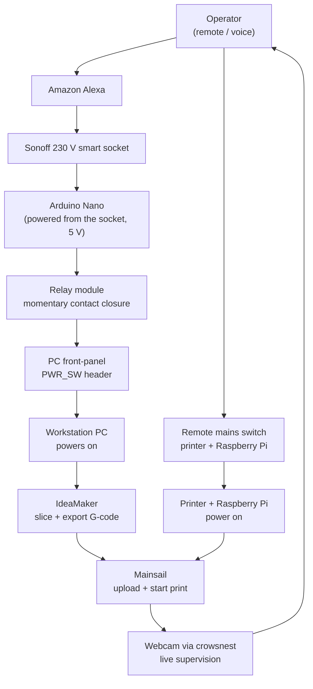

# Printer #1 — Anet A8 Plus → Klipper / MainsailOS Conversion

> Converting an Anet A8 Plus from **Marlin + OctoPrint** to **Klipper + Mainsail**, running on a
> Raspberry Pi 3B+ with a BigTreeTech SKR 2 controller, sliced with the **latest version of
> IdeaMaker** — and fully operable remotely.

This repository is a complete build log and configuration archive. The goal is that the printer
can be **rebuilt from scratch using only the files in this repo**.

---

## Table of Contents

1. [Project Background](#1-project-background)
2. [System Architecture](#2-system-architecture)
3. [Remote Operation](#3-remote-operation)
4. [Hardware](#4-hardware)
5. [Repository Structure](#5-repository-structure)
6. [Rebuild Guide](#6-rebuild-guide)
7. [Key Configuration Values](#7-key-configuration-values)
8. [IdeaMaker Slicer Setup](#8-ideamaker-slicer-setup)
9. [Calibration Results](#9-calibration-results)
10. [Printed Upgrade Parts](#10-printed-upgrade-parts)
11. [References](#11-references)

---

## 1. Project Background

Printer #1 originally ran **Marlin firmware with OctoPrint**. It suffered from recurring problems:

- Inconsistent **bed adhesion**
- Unstable **temperature control**
- Poor and inconsistent print quality, leading to frequent failed prints
- Repeated bed-height calibration did not solve the underlying issues

Meanwhile, **Printer #2** had been running reliably for years on **Klipper + Mainsail**. Based on
that track record, the decision was made to migrate Printer #1 to the same platform.

The migration required separating the **IP addresses and Raspberry Pi hostnames** of the two
printers so both could coexist on the same network (two Raspberry Pis, two independent Mainsail
instances).

### Outcome

After the conversion the printer has been running **stably**, with no further adhesion or
temperature problems, and significantly improved print performance. Dimensional accuracy was then
dialled in through a documented calibration cycle (see section 9), and the whole workflow — from
slicing to starting the print — became operable without physically touching the machine
(see section 3).

---

## 2. System Architecture


**Division of labour:** the Raspberry Pi does all motion planning, kinematics, pressure advance
and bed-mesh compensation. The SKR 2 only executes pre-computed step timings. This is why the
Klipper configuration lives entirely in `printer.cfg` on the Pi, and the firmware on the board
almost never needs reflashing.

---

## 3. Remote Operation

A core goal of the conversion was **full remote control**: the entire chain — workstation, printer
power, slicing, print start and supervision — can be driven without being in the same room as the
machine.



### Remote power-on of the workstation

The PC is **not** started with Wake-on-LAN. Instead it is started by physically pressing its own
power button, electrically:

1. The operator issues a switch-on command to **Amazon Alexa** (voice or app).
2. Alexa switches on a **Sonoff 230 V smart socket**.
3. The socket feeds an **Arduino Nano**, which therefore boots the moment mains power appears.
4. On start-up the Nano drives a **relay module**.
5. The relay **closes the contacts of the PC's power button** (the `PWR_SW` front-panel header),
   which boots the workstation.

The advantage over Wake-on-LAN is that it is completely independent of the BIOS, the network card,
the operating system and Windows fast-startup. It works even after a full power loss, because it
emulates the same physical action a person would perform.

> **Important:** the relay must produce a **short pulse (roughly 0.3–1 s), not a permanent
> closure.** A continuously held power button is interpreted by the PC as a forced shutdown
> request. The Nano sketch should therefore pulse the relay once after boot and then leave it
> open.

### What each piece does

| Capability | How | Result |
|---|---|---|
| **Start the PC remotely** | Alexa → Sonoff 230 V socket → Arduino Nano (5 V) → relay module → PC power-button contacts | The slicing machine is brought up on demand; no need to leave it running |
| **Start the printer remotely** | Remotely switchable mains power feeding the printer and the Pi | The machine stays powered down between jobs and is energised only when a print is planned |
| **Slice remotely** | Remote desktop onto the workstation, IdeaMaker running there | The slicer profile lives on one machine only — no profile drift |
| **Upload and start** | Mainsail web UI / Moonraker API on port 7125 | Upload `.gcode`, start, pause, cancel, tune live |
| **Watch the print** | `crowsnest` webcam stream embedded in Mainsail | Visual confirmation of the first layer and of progress |
| **Timelapse** | `moonraker-timelapse` (`timelapse.cfg`) | Automatic video of completed prints |

### Why the printer is kept unpowered between jobs

Leaving a heated-bed printer permanently energised is the main fire-risk scenario in a home
workshop. Putting the mains feed on a remotely switchable outlet makes the **default state "off"**,
and power is applied only for the duration of a supervised job. The Raspberry Pi boots in under a
minute, so there is no practical downside.

### Requirements and safety rules

- **Pulse, do not hold, the PC power button.** The Arduino Nano must close the relay only
  momentarily after boot; a permanently closed contact forces the PC off instead of on.
- **Use the relay contacts only as a dry switch** across the `PWR_SW` header. Never feed the
  Arduino's 5 V into the header — the relay must isolate the two circuits.
- **Set the PC BIOS "restore on AC power loss" option to "stay off"**, otherwise the machine may
  boot on its own and the relay pulse will shut it down again.
- **Give the Pi and the PC reserved DHCP leases** so their addresses never move.
- **Do not expose Mainsail or Moonraker directly to the internet.** Moonraker has no
  authentication model suitable for public exposure; `moonraker.conf` in this repo trusts private
  LAN ranges only. Reach the printer from outside over a **VPN**.
- **Never start a heater without a working camera view.** Remote power-on combined with an
  unattended thermal fault is precisely the combination to avoid.
- **Always verify the first layer on the camera** before leaving the print unattended.
- Keep a **physically reachable power cut-off**. A remote switch must never be the only way to
  de-energise the printer.

---

## 4. Hardware

| Component | Part | Notes |
|---|---|---|
| Base printer | Anet A8 Plus | 300 × 300 × 300 mm build volume |
| Frame | Reinforced aluminium-extrusion conversion | Diagonal bracing + corner gussets (AM8-style). Replaces the original acrylic frame. |
| Controller | BigTreeTech **SKR 2** | STM32F407 (verify — later batches use STM32F429) |
| Stepper drivers | **TMC2209** ×4 | UART mode |
| Host | **Raspberry Pi 3B+** | MainsailOS 64-bit |
| Hotend | **Volcano V6** | Custom mounting solution |
| Probe | **BLTouch / 3D Touch** | Automatic bed mesh levelling |
| Power | **External MOSFET** for the heated bed | Offloads bed current from the board |
| Mains control | **Remotely switchable outlet** (smart plug / relay) | Allows the printer to be powered up and down remotely — see section 3 |
| Camera | USB / Pi camera via **crowsnest** | Live view for remote supervision; timelapse support included |
| Slicer host | Workstation PC, started by the Sonoff + Arduino Nano + relay circuit | Runs the latest IdeaMaker; can be started remotely — see section 3 |
| PC remote start | **Sonoff 230 V smart socket** + **Arduino Nano** + **relay module** | Alexa-triggered; the relay shorts the PC power-button contacts |

> ⚠️ **Check your SKR 2 revision.** The initial revision of this board has a known flaw that can
> damage itself and other boards. Verify your board is not affected before powering it up.

---

## 5. Repository Structure

| Path | Contents |
|---|---|
| `Configuration_Files_Mainsail_Klipper/` | `printer.cfg`, `moonraker.conf`, `mainsail.cfg`, `crowsnest.conf`, `sonar.conf`, `timelapse.cfg` — the full working Klipper/Moonraker config set |
| `Calibration/` | Calibration log in **English** and **Hungarian**, test photos, IdeaMaker profile PDF, flow-calibration cube G-code |
| `IdeaMaker_Profiles/` | Slicer **Start G Code** and **End G Code** |
| `IdeaMaker_Models/` | `.idea` project files and `.3mf` models actually printed on this machine |
| `Consoles_and_Parts/` | STL files for printed upgrade parts (belt tensioners, fan duct, Pi case, spacers) |
| `Pictures/` | Build and diagnostic photos (BLTouch wiring, external MOSFET, printer render, test prints) |
| `SKR2_User manual/` | BigTreeTech SKR 2 pinout PDF |
| `Mainsail and Klipper Anet A8 Plus_RPI3_SKR2.pdf` | Step-by-step conversion presentation (also `.pptx`) |

---

## 6. Rebuild Guide

### Step 1 — Flash MainsailOS onto the SD card

1. Install **Raspberry Pi Imager**.
2. Choose **Other specific-purpose OS → 3D printing → MainsailOS (64-bit)**.
3. In the Imager's advanced settings, configure **before** writing:
   - **Hostname** — must be unique per printer (this build uses `pi1`)
   - **Wi-Fi SSID + password**
   - **SSH enabled**, username and password
4. Write the image and boot the Pi.

> **Running two printers?** Give each Pi a distinct hostname *and* a reserved (static) DHCP lease
> in the router. Two Pis = two independent Mainsail instances. Mixing them up is the most common
> cause of "I edited the config and nothing changed".

### Step 2 — Build the Klipper firmware for the SKR 2

SSH into the Pi (e.g. with **Tera Term** or any SSH client) and run:

```bash
cd ~/klipper
make menuconfig
```

Select:

| Option | Value |
|---|---|
| Micro-controller Architecture | `STMicroelectronics STM32` |
| Processor model | `STM32F407` *(use `STM32F429` if that is the chip on your board)* |
| Bootloader offset | `32KiB bootloader` |
| Communication interface | `USB (on PA11/PA12)` |

Then build:

```bash
make clean
make
```

The output is `~/klipper/out/klipper.bin`.

### Step 3 — Flash the board

`make flash` **does not work** on the SKR 2. Flash via SD card instead:

1. Download `out/klipper.bin` from the Pi (e.g. with **FileZilla** over SFTP).
2. Rename it to **`firmware.bin`**.
3. Copy it to a FAT32 SD card and insert it into the SKR 2.
4. Make sure the SKR 2 **power-source jumper is set correctly (5 V mode)**.
5. Power-cycle the board.
6. **Verification:** the file on the SD card is renamed to `firmware.cur`. If it still says
   `firmware.bin`, the flash did not happen — check the card format, the filename and the jumper.

### Step 4 — Find the MCU serial ID

On the Pi:

```bash
ls /dev/serial/by-id/*
```

Copy the returned path into the `[mcu]` section of `printer.cfg`. Example from this build:

```ini
[mcu]
serial: /dev/serial/by-id/usb-Klipper_stm32f407xx_2D0027000C47393437303337-if00
```

> This ID is **unique to your board** — it will not match the value in this repo. You must
> replace it.

### Step 5 — Upload the configuration

Copy `Configuration_Files_Mainsail_Klipper/printer.cfg` to the Pi, either through the Mainsail
web UI (**Machine** tab) or over SFTP to `~/printer_data/config/`.

Then check `moonraker.conf` — the `[authorization] trusted_clients` list must include your LAN
subnet, otherwise the web UI will refuse the connection.

Restart Klipper from Mainsail (`FIRMWARE_RESTART`).

### Step 6 — Wire and enable the BLTouch

Wiring photos: `Pictures/3d_touch.jpg`, `3d_touch_2.jpg`, `3d_touch_pins.jpg`.

The probe replaces the Z endstop — note that `[stepper_z]` uses
`endstop_pin: probe:z_virtual_endstop`.

### Step 7 — Safety checks before the first print

Run these **in order**, and keep a hand on the power switch:

```gcode
# 1. Thermistors read plausible room temperature?      -> check Mainsail dashboard
# 2. Does the probe deploy/stow?
BLTOUCH_DEBUG COMMAND=pin_down
BLTOUCH_DEBUG COMMAND=pin_up
# 3. Do the axes move the RIGHT way and hit the endstops?
G28
# 4. PID tuning
PID_CALIBRATE HEATER=extruder TARGET=200
PID_CALIBRATE HEATER=heater_bed TARGET=60
SAVE_CONFIG
# 5. Probe Z offset
PROBE_CALIBRATE
SAVE_CONFIG
# 6. Bed mesh
G28
BED_MESH_CALIBRATE
SAVE_CONFIG
```

> `SAVE_CONFIG` **restarts Klipper** — that is normal. It writes results into the auto-generated
> block at the bottom of `printer.cfg`, which **overrides** the values at the top of the file.

### Step 8 — Calibrate the extruder

Mark 120 mm of filament, then extrude 100 mm and measure what is left. `printer.cfg` already
contains `max_extrude_only_distance: 150` specifically to allow the 100 mm test (the Klipper
default of 50 mm is too small).

---

## 7. Key Configuration Values

From `Configuration_Files_Mainsail_Klipper/printer.cfg`:

### Motion

| Setting | Value | Why |
|---|---|---|
| `kinematics` | `cartesian` | |
| `stepper_x` / `stepper_y` `rotation_distance` | **40** | Theoretical value for a 16-tooth GT2 pulley — **do not change** |
| `stepper_z` `rotation_distance` | **8** | TR8×8 lead screw, mathematically exact — **never change** |
| `microsteps` | 16 (all axes) | |
| `position_max` X / Y / Z | 300 / 300 / 300 | |
| `max_velocity` | 300 mm/s | |
| `max_accel` | **1500** mm/s² | Reduced from 3000 to suppress ringing and corner defects |
| `square_corner_velocity` | 5.0 | |
| `max_z_velocity` / `max_z_accel` | 5 / 100 | |

### Extruder

| Setting | Value |
|---|---|
| `rotation_distance` | 35.845 (calibrated) |
| `nozzle_diameter` | 0.400 mm |
| `sensor_type` | EPCOS 100K B57560G104F |
| `max_temp` | 250 °C |
| `max_extrude_only_distance` | 150 mm |
| `pressure_advance` | 0.05 |
| `pressure_advance_smooth_time` | 0.040 |
| TMC2209 `run_current` | 0.600 A |

### Bed & Probe

| Setting | Value |
|---|---|
| `heater_bed` `sensor_type` | Generic 3950 |
| BLTouch `x_offset` / `y_offset` | **−30 / −25** |
| BLTouch `z_offset` | 1.25 |
| `samples` / `samples_result` | 2 / average |
| `safe_z_home` `home_xy_position` | 150, 150 (bed centre) |
| `bed_mesh` area | 35,30 → 280,280 |
| `bed_mesh` `probe_count` | 5 × 5, bicubic |
| XY/Z TMC2209 `run_current` | 0.800 A |

### SKR 2 specifics

```ini
# BTT implements a Marlin-specific "anti-reversal stepper protection".
# This pin MUST be pulled high or the stepper drivers and most FETs get no power.
[output_pin motor_power]
pin: PC13
value: 1
```

Forgetting this block is the classic "motors do nothing and there is no error message" failure on
the SKR 2.

---

## 8. IdeaMaker Slicer Setup

The slicer belonging to this printer is **IdeaMaker, latest version** (Raise3D). It is free, and
the profile stored in this repository is maintained against the current release — download it from
<https://www.raise3d.com/ideamaker/>.

Copy the contents of `IdeaMaker_Profiles/` into the printer definition in IdeaMaker.

**Start G-code** — homes all axes, moves to a bed-edge reference point, sets the coordinate zero
and performs a slow Z touch-off before lifting and priming.

**End G-code** — turns off both heaters, retracts in two stages while lifting Z, and disables the
steppers.

**Acceleration and Jerk are deliberately disabled in the slicer.** Klipper handles motion planning
itself, and letting the slicer inject `M204`/`M205` would fight the `max_accel` and
`square_corner_velocity` settings in `printer.cfg`.

The full profile is documented as screenshots in
`Calibration/Printer1_ANET_A8_Plus_RPI3_SKR2_Ideamaker_Current_Profile.pdf`.

---

## 9. Calibration Results

Test object: **50 × 50 × 50 mm** calibration cube. Full narrative in
[Calibration/Calibration_log_EN.txt](Calibration/Calibration_log_EN.txt) (Hungarian version:
[Kalibracios_naplo_HU.txt](Calibration/Kalibracios_naplo_HU.txt)).

| Test | X (mm) | Y (mm) | Z (mm) | Key settings |
|---|---|---|---|---|
| #1 | 48.63 (−1.37) | 49.76 (−0.24) | 50.21 (+0.21) | X rot.dist 40.9, z_offset 1.15, no PA, accel 3000 |
| #2 | 49.74 (−0.26) | 49.79 (−0.21) | 50.17 (+0.17) | X rot.dist **40** (fixed), PA 0.05, accel 1500 |
| #3 | **49.94** (−0.06) | **49.97** (−0.03) | **50.06** (+0.06) | z_offset 1.25 |

All three axes are now within **0.1 mm** (≈0.1 %).

### Lessons recorded

- **The X error was not mechanical.** A −2.74 % deviation looked like a loose belt, but solving
  `measured = 50 × RD_actual / RD_configured` for both axes gave nearly identical results
  (39.78 vs 39.81), proving the fault was the mistyped `rotation_distance` of 40.9.
- **Z height error does not come from `rotation_distance`.** With a TR8×8 screw the value 8 is
  exact. From the second layer onward every layer is correct — *all* height error is created in
  the **first layer**. The fix is always the probe `z_offset`.
- **Klipper sign rule:** a *larger* `z_offset` = nozzle *closer* to the bed = more squish =
  *shorter* part.
- **`SAVE_CONFIG` wins.** Once it has run, the value at the top of `printer.cfg` is ignored. To
  edit manually you must first delete the corresponding lines from the `#*#` block, then run
  `FIRMWARE_RESTART`.
- **A Z value below −4 shown in Mainsail is the head *position*, not the offset.** The dashboard
  live-adjust field and the `PROBE_CALIBRATE` panel are two different things. If you see this
  before a move — stop.

---

## 10. Printed Upgrade Parts

STLs in `Consoles_and_Parts/`:

| File | Purpose |
|---|---|
| `belt_tensioner_A2.stl`, `belt_tensioner_B2.stl` | Belt tensioners (see `belt_tensioner.png`, `beltA2.png`, `beltB2.png`) |
| `Fan_Nozzle_V2.stl` | Part-cooling fan duct |
| `Spacer_for_extruder_part.stl` | Extruder mounting spacer |
| `anet_tavtarto_63mm.stl` | 63 mm Anet spacer |
| `Rpi_4_Case_Bottom.stl` / `_Top.stl` | Raspberry Pi enclosure (plus HDMI-cable variants) |

---

## 11. References

- Klipper documentation — <https://www.klipper3d.org/>
- Pressure Advance tuning — <https://www.klipper3d.org/Pressure_Advance.html>
- Mainsail — <https://docs.mainsail.xyz/>
- MainsailOS — <https://docs.mainsail.xyz/setup/mainsail-os>
- SKR 2 pinout — `SKR2_User manual/BIGTREETECH SKR 2-Pin.pdf`
- Conversion presentation — `Mainsail and Klipper Anet A8 Plus_RPI3_SKR2.pdf`

### Tools used

| Tool | Role |
|---|---|
| Raspberry Pi Imager | Write MainsailOS to SD |
| FileZilla | SFTP transfer of `klipper.bin` and `printer.cfg` |
| Tera Term | SSH session to the Pi |
| **IdeaMaker (latest version)** | Slicer |
| Mainsail | Web interface and remote print control |
| Alexa + Sonoff 230 V socket | Remote power-on of the workstation (via Arduino Nano + relay) |
| Arduino IDE | Sketch for the Nano that pulses the relay on boot |
| Remote mains switch | Remote power-on of the printer |
 

